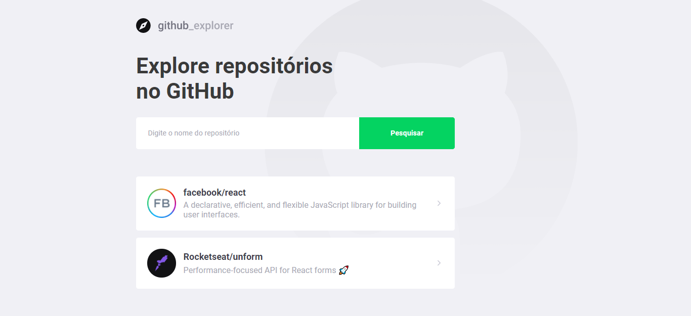

<h1 align="center">
  
</h1>

<h3 align="center">
  GitHub Explorer
</h3>

Explore repositórios do GitHub

  <a href="#como-executar-o-projeto">Como executar o projeto</a>&nbsp;&nbsp;&nbsp;|&nbsp;&nbsp;&nbsp;
  <a href="#anotações">Anotações</a>

Front-end

  

## Como executar o projeto

### Requisitos

- [Node.js](https://nodejs.org)
- [Yarn](https://yarnpkg.com)

### Executar

- `git clone https://github.com/eliasmcastro/rocketseat-bootcamp-gostack-11.0-github-explorer.git` para clonar este repositório
- `cd rocketseat-bootcamp-gostack-11.0-github-explorer` para entrar na pasta
- `yarn` para instalar as dependências do projeto
- `yarn start` para iniciar a aplicação
- Acessar http://localhost:3000

## Anotações

### Criando um projeto

Executar `create-react-app nome-do-projeto --template=typescript` para criar um projeto

### Padrões de Projeto com Eslint, Prettier e Editor Config

- [Documentação](https://www.notion.so/Padr-es-de-projeto-com-ESLint-Prettier-e-EditorConfig-0b57b47a24724c859c0cf226aa0cc3a7)

### Layout no Figma

- [Layout](https://www.figma.com/file/HOCmxfrElzLpI75LdzFLia/Github-Explorer?node-id=0%3A1)

### Trabalhando com rotas

- Executar `yarn add react-router-dom` para instalar o react-router-dom
- Executar `yarn add @types/react-router-dom -D` para baixar a tipagem

### Styled Components

- Executar `yarn add styled-components` para instalar o Styled Components
- Executar `yarn add @types/styled-components -D` para baixar a tipagem

### Polished para trabalhar com cores

- Executar `yarn add polished` para instalar o polished

### Trabalhando com ícones

- Executar `yarn add react-icons` para instalar a biblioteca de ícones

### Axios

- Executar `yarn add axios` para instalar o axios
